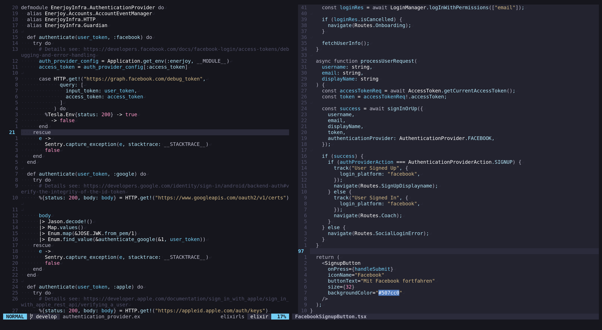
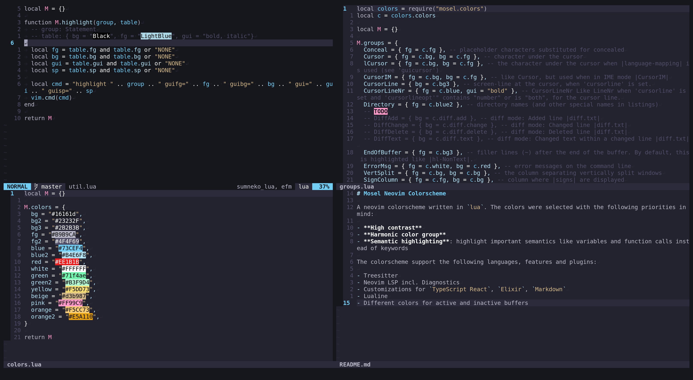

# Mosel Neovim Colorscheme

A neovim colorscheme written in `lua`. The colors were selected with the following priorities in mind:

- **High contrast**
- **Harmonic color group**
- **Semantic highlighting**: highlight important semantics like variables and function calls instead of keywords

## Preview

Active Buffer: Elixir, inactive buffer: TypeScript React

Active Buffer: Lua, inactive buffers: Lua and Markdown

## Features

The colorscheme supports the following languages, features and plugins:

- Treesitter
- Neovim LSP incl. Diagnostics
- Customizations for `TypeScript React`, `Elixir`, `Markdown`
- Lualine
- Different colors for active and inactive buffers

### Limitations

- `termguicolors` required
